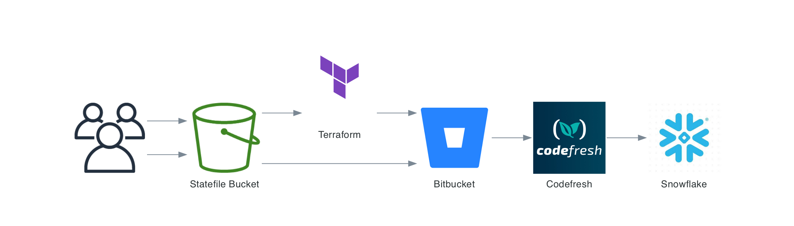

# terraform-snowflake-oauth-integrations module

This is a repository that makes a `schema` with a `schema_grant` with Snowflake:

- schema
- schema_grant

Example CICD with `BitBucket` and `Codefresh`:



## Usage

To use the module you will need to use the following:

```hcl
module "snowflake_schema_test" {
  source  = "https://github.com/Richard-Barrett/terraform-snowflake-schemas"
  version = "0.0.1"

  database     = "TEST"
  schema_name  = "TEST"
}
```

Required Values:

| Values         |
|----------------|
| database |
| schema_name |

## Overview

In overview, this repository acts as a digestible module that allows you to create `schemas` with an associated `schema_grant` in Terraform for Snowflake.

<!-- BEGIN_TF_DOCS -->
## Requirements

| Name | Version |
|------|---------|
| <a name="requirement_terraform"></a> [terraform](#requirement\_terraform) | >= 1.5.7 |
| <a name="requirement_snowflake"></a> [snowflake](#requirement\_snowflake) | ~> 0.89.0 |

## Providers

| Name | Version |
|------|---------|
| <a name="provider_snowflake"></a> [snowflake](#provider\_snowflake) | ~> 0.89.0 |

## Modules

No modules.

## Resources

| Name | Type |
|------|------|
| [snowflake_schema.this](https://registry.terraform.io/providers/Snowflake-Labs/snowflake/latest/docs/resources/schema) | resource |
| [snowflake_schema_grant.this](https://registry.terraform.io/providers/Snowflake-Labs/snowflake/latest/docs/resources/schema_grant) | resource |

## Inputs

| Name | Description | Type | Default | Required |
|------|-------------|------|---------|:--------:|
| <a name="input_comment"></a> [comment](#input\_comment) | value for comment | `string` | `""` | no |
| <a name="input_data_retention_days"></a> [data\_retention\_days](#input\_data\_retention\_days) | value for data retention days | `number` | `30` | no |
| <a name="input_database"></a> [database](#input\_database) | Name of the database for granting schema access | `string` | n/a | yes |
| <a name="input_enable_multiple_grants"></a> [enable\_multiple\_grants](#input\_enable\_multiple\_grants) | When this is set to true, multiple grants of the same type can be created. This will cause Terraform to not revoke grants applied to roles and objects outside Terraform. | `bool` | `true` | no |
| <a name="input_is_managed"></a> [is\_managed](#input\_is\_managed) | value for is\_managed | `bool` | `false` | no |
| <a name="input_is_transient"></a> [is\_transient](#input\_is\_transient) | value for is\_transient | `bool` | `false` | no |
| <a name="input_on_all"></a> [on\_all](#input\_on\_all) | When this is set to true, apply this grant on all schemas in the given database. The schema\_name and shares fields must be unset in order to use on\_all. Cannot be used together with on\_future. | `bool` | `false` | no |
| <a name="input_on_future"></a> [on\_future](#input\_on\_future) | (Boolean) When this is set to true, apply this grant on all future schemas in the given database. The schema\_name and shares fields must be unset in order to use on\_future. Cannot be used together with on\_all. | `bool` | `false` | no |
| <a name="input_privilege"></a> [privilege](#input\_privilege) | Privilege for the schema grant | `string` | `"USAGE"` | no |
| <a name="input_roles"></a> [roles](#input\_roles) | List of roles to grant access to schema\_name | `list(string)` | <pre>[<br>  ""<br>]</pre> | no |
| <a name="input_schema_name"></a> [schema\_name](#input\_schema\_name) | Name of the schema | `string` | n/a | yes |
| <a name="input_shares"></a> [shares](#input\_shares) | Grant privilege to shares (only valid if on\_future and on\_all are unset 'DEFAULT') | `list(string)` | n/a | yes |
| <a name="input_with_grant_option"></a> [with\_grant\_option](#input\_with\_grant\_option) | (Boolean) When this is set to true, allows the recipient role to grant the privileges to other roles. | `bool` | `false` | no |

## Outputs

No outputs.
<!-- END_TF_DOCS -->
